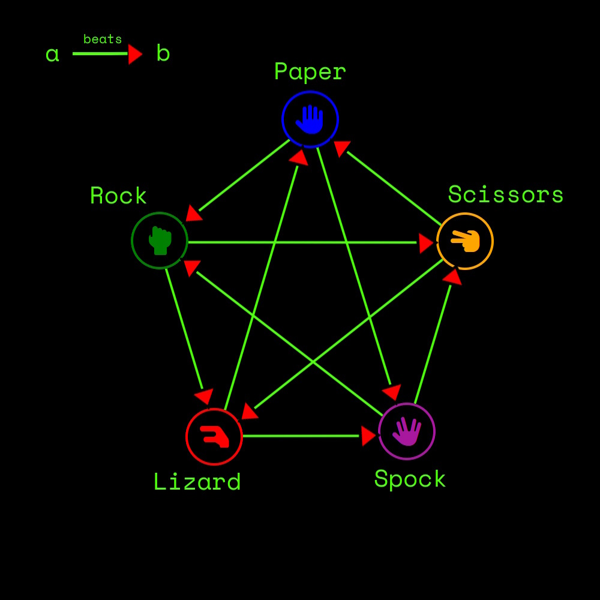

# Rock Spock And One Poison Lizard

[LiveSite](https://guysteeleperkins.github.io/Rock-Spock-and-one-poison-Lizard/)
 
[Repository](https://github.com/Guysteeleperkins/Rock-Spock-and-one-poison-Lizard)

.png)
https://ui.dev/amiresponsive?url=https://guysteeleperkins.github.io/Rock-Spock-and-one-poison-Lizard/

## Overview

Rock Spock and One Poison Lizard is an online game adaptation of Rock, Paper, Scissors that adds two more elements "Lizard" and "Spock" inspired from the Tv series - The Big Bang Theory. Users can play against a computer and the computer choice and outcome of the game will be visible to the user. This creates a fun interactive game for the player.

---

## CONTENTS

* [User Experience](#user-experience-ux)
  * [Rules](#rules)
  * [User Stories](#user-stories)

* [Design](#design)
  * [Colour Scheme](#colour-scheme)
  * [Typography](#typography)
  * [Imagery](#imagery)
  * [Wireframes](#wireframes)

* [Features](#features)
  * [General Features on Each Page](#general-features-on-each-page)
  * [Future Implementations](#future-implementations)
  * [Accessibility](#accessibility)

* [Technologies Used](#technologies-used)
  * [Languages Used](#languages-used)
  * [Frameworks, Libraries & Programs Used](#frameworks-libraries--programs-used)

* [Deployment & Local Development](#deployment--local-development)
  * [Deployment](#deployment)

* [Testing](#testing)

* [Credits](#credits)

---

## User Experience (UX)

### Rules

- Scissors cuts Paper
- Paper covers Rock
- Rock crushes Lizard
- Lizard poisons Spock
- Spock smashes Scissors
- Scissors decapitates Lizard
- Lizard eats Paper
- Paper disproves Spock
- Spock vaporizes Rock
- (and as it always has) Rock crushes Scissors

## User Stories

### Must Have User Stories
---

### 1. User Story: Game Selection
**As a user**, I want to select either "Rock," "Paper," "Scissors," "Lizard," or "Spock" before each round, so that I can play the game with my preferred choice.

#### Acceptance Criteria:
- The game offers five clickable buttons, each representing one of the possible choices.
- I can select my choice by clicking a button.
- After selection, the system registers my choice for the current round.

### 2. User Story: Computer Opponent
**As a user**, I want the computer to automatically select a random choice after I’ve made my selection, so that I can play against an AI opponent.

#### Acceptance Criteria:
- The computer’s choice is made randomly.
- The computer’s choice is displayed after the user makes a choice.
- The game compares the user’s choice and the computer’s choice to determine the winner.
- The computer determines user patterns and adapts choices to be more likely to win.

### 3. User Story: Score Tracking
**As a user**, I want to keep track of the score between myself and the computer, so that I can monitor my performance over multiple rounds.

#### Acceptance Criteria:
- A scoreboard is visible during the game.
- The scoreboard updates after each round, displaying the total wins, losses, and ties for both the player and the computer.
- The scores reset when the player starts a new game session.

### 4. User Story: Game Result Display
**As a user**, I want to see a clear message showing whether I won, lost, or tied after each round, so that I can understand the outcome.

#### Acceptance Criteria:
- After each round, a result message displays ("You Win!", "You Lose!", or "It's a Tie!").
- The message displays the interactions between the player’s and the computer’s choices.
- The message disappears when a new round starts.

### 5. User Story: Mobile Responsiveness
**As a user playing on a mobile device**, I want the game interface to be responsive and easy to use on a smaller screen, so that I can enjoy the game on my phone or tablet.

#### Acceptance Criteria:
- The game layout adjusts to various screen sizes.
- Buttons are large enough to be tapped easily on a mobile device.
- All text and icons are readable without zooming in.

### 6. User Story: Rules Display
**As a user**, I want to see the rules of the game on the homepage, so that I can understand how each choice interacts with the others.

#### Acceptance Criteria:
- A section of the homepage explains how each option beats or loses to the others.
- The rules are clear, concise, and easy to understand.

---

### Should Have User Stories
---

### 1. User Story: Picture Feedback
**As a user**, I want to see visual feedback when I make my selection, so that I know the game registered my input.

#### Acceptance Criteria:
- After selecting an option, a picture represents the choice that has been made.
- The computer’s choice is also accompanied by visual feedback.

### 2. User Story: Play Again 
**As a user**, I want an easy way to play another round after a match ends, so that I can continue playing without refreshing the page.

#### Acceptance Criteria:
- After each round the buttons automatically reset.
- After making a choice the buttons return to their original positions ready to play again.

### 3. User Story: Pick Player
**As a user**, I want to be able to pick a character that I can play as from a list of characters.

#### Acceptance Criteria:
- The player is able to choose an avatar from a list of characters.

---

### Could Have User Stories
---

### 1. User Story: Game Length
**As a user**, I would like to determine the number of individual games in each round, so I can play best of 3, 5, etc.

#### Acceptance Criteria:
- The user has a selection of buttons to determine game length in rounds.
- The winner is determined by winning the set number of rounds.

### 2. User Story: Sound Effects
**As a user**, I want the game to have sound effects for selections, results, and victories, so that the gameplay feels more immersive.

#### Acceptance Criteria:
- Sound effects play when the user makes a choice, when the computer makes a choice, and when the round result is displayed.
- The user can toggle sound effects on or off via a settings menu.

### 3. User Story: Difficulty Levels
**As a user**, I want to be able to make the game more difficult by preventing the spamming of one choice.

#### Acceptance Criteria:
- The game will have two levels of difficulty:
  - **Easy**: Computer choice is completely random.
  - **Difficult**: Computer recognizes patterns in the user's choices and adapts its choices accordingly.

---

### Won't Have User Stories
---

### 1. User Story: 2 Player
**As a user**, I would like to be able to play a game against my friend.

### 2. User Story: Timed Mode
**As a user**, I want the option to play a timed mode where I have a limited time to make a choice, so that I can add a layer of challenge to the game.

## Design

### Colour Scheme

We went for a classic arcade feel with the color schemes.

### Typography

We selected fonts to compliment the arcade style.

### Imagery

We found fun pictures of characters to use within an avatar selector.

### Wireframes

We used balsamic to create the wireframes.

## Features

### Future Implementations

The future features we want to add are;
- Choose a best of "number of rounds" mode eg best of 3, best of 5.
- Health bars for the chosen characters
- Faster loading times
- Smoother transitions
- Add a picture for the choices to appear
- Add a message for the choices made when winning or losing

### Accessibility

We have implemented aria labels and image descriptions. Lighthouse dev tool shows a score of 88 highlighting that buttons
don't have accessibility conent. This would be a quick fix but run out of time due to deadline.

## Technologies Used

### Languages Used

For this project we have used HTML, CSS and Javascript.

### Frameworks, Libraries & Programs Used

We have used the following;
- Github
- Gitpod
- Slack
- Bootstrap
- Google Meet 

## Deployment

### Deployment & Development

We have Deployed the project using Github. The team has had practice deploying from previous projects so the deployment went smoothly. 
For development we used Gitpod and had 3 occasions where we had issues after merging branches with the main. These included overwriting of Javascript
code which resulted in buttons not working. This was a fast fix as we all had a backup before the merge.  
We also ran into styling issues on the deployed page after implementing the rules modal. This was fixed by debugging an extra div tag that had turned up in the middle of the HTML.

## Testing

  
We used this for html.

  
we used this for Css

  
We used this for Javascript

## Credits

https://coolors.co/  
https://chatgpt.com/  
https://getbootstrap.com/  
https://unsplash.com/  
https://ui.dev/amiresponsive?url=https://guysteeleperkins.github.io/Rock-Spock-and-one-poison-Lizard/  
https://www.google.com/  
https://miro.com/app/dashboard/  
https://fonts.google.com/  
https://www.dafont.com/cosmic-alien.font

